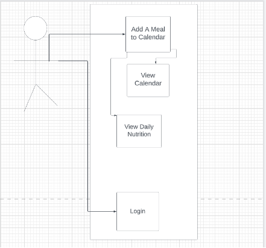
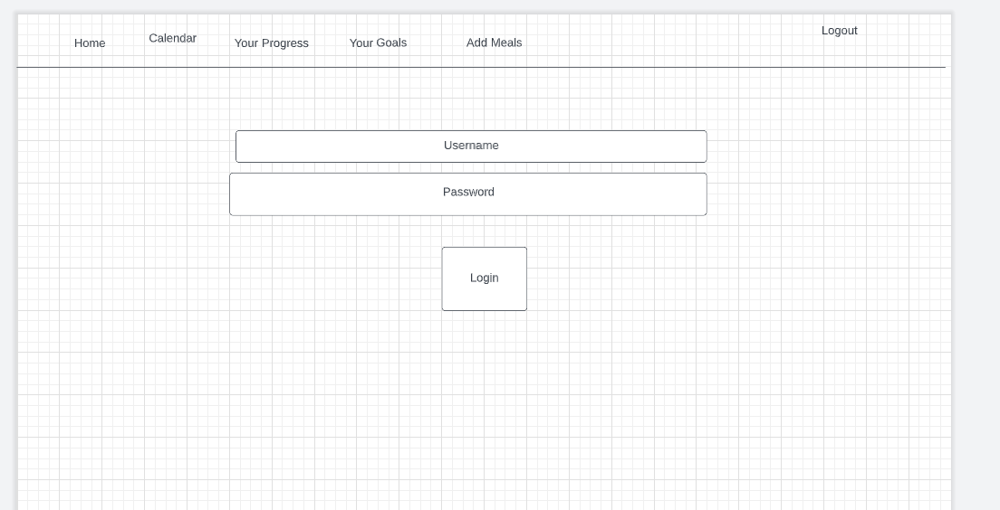
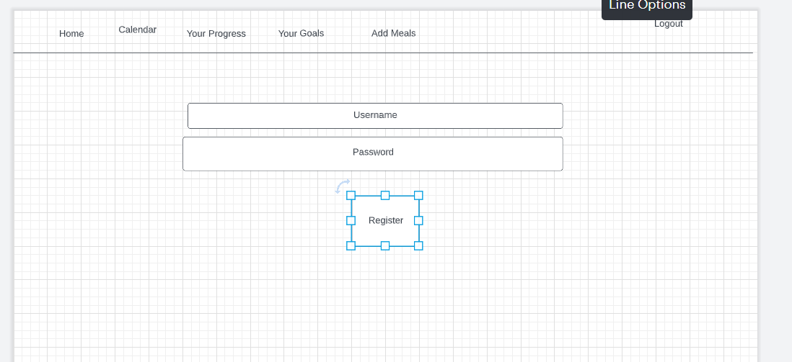
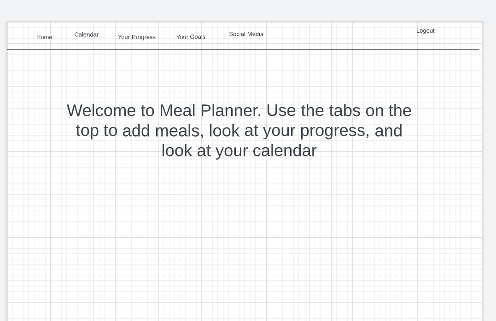
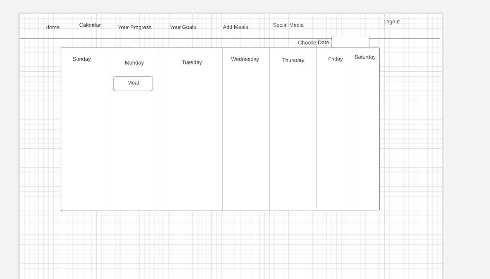
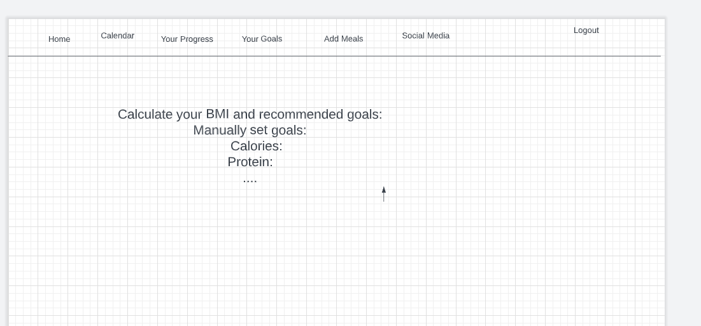
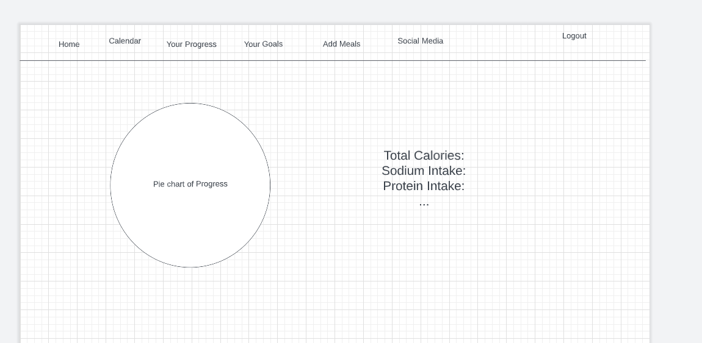
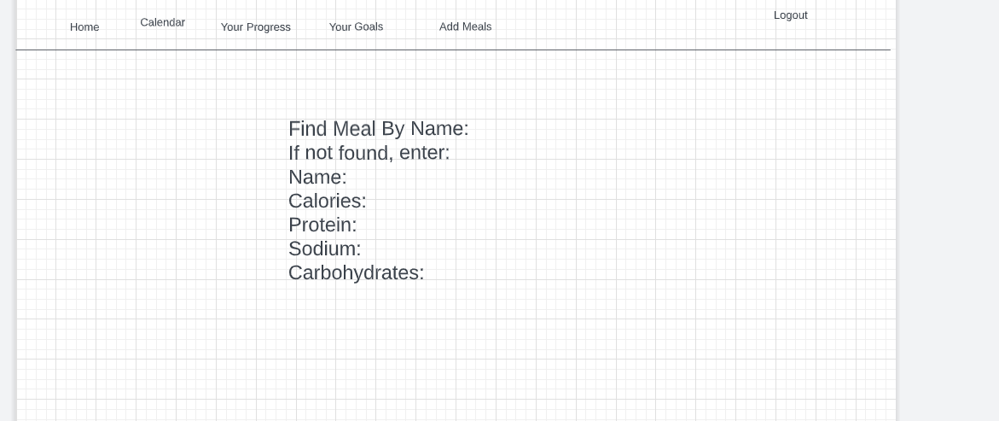
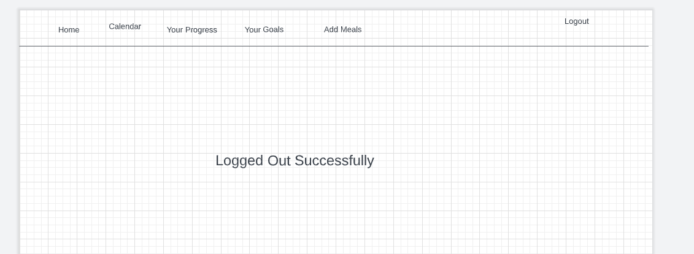

### Lab 10: SoftWare Development

#### Team Number 8

#### Team name: Something Useful

#### Team Members:
1. Jason Pabelico (japa9944) japa9944@colorado.edu 
2. Nikhil Chakka (nikhilc1013) nich4416@colorado.edu 
3. Kash Challapalli (KC-ai) kach4276@colorado.edu 
4. Trajan Pei (trpe3369) trpe3369@colorado.edu   
5. Tien Vu (tivu4885) tivu4885@colorado.edu   
6. Angela Nguyen (boncannotcode) anng5164@colorado.edu 

#### Application Name: Meal Planner
#### Application Description: 
Our app tracks the nutrition intake of users based on calories and nutritional value. It allows them to plan their meals on a day to day basis on a weekly calendar. Bot Meal Planner is similar to other calorie tracker apps.
In addition, there is a social media page on the app that allows users to update friends and followers about their progress by sharing images, their calendars, and exercise activity.

#### Vision Statement: 
For users that want to gain or lose weight, as well as eating healthier, Bot Meal Planner is a nutritional tracker for users to reach their goals. Unlike MyFitnessPal, we have a built- in bot and a social media page to motivate users.

#### Communication Plan: 
Messages

#### Meeting Plan:
Weekly Meeting with TA: Monday @6:45 PM https://cuboulder.zoom.us/j/6808546254
Team Meeting: @6:00 pm

#### Use Case Diagram

#### Wireframe

